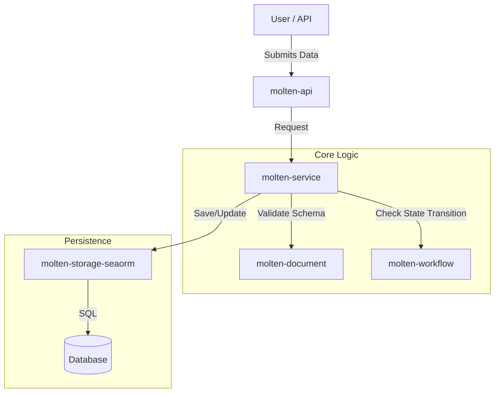

# Molten Architecture & Domain Model

This document outlines the conceptual design and vocabulary used within the Molten ecosystem. Understanding these concepts is essential for contributing to `molten-core` and `molten-service`.

## The Hierarchy

Molten operates on a hierarchy of definitions that transform raw data into managed processes.

### 1. Application
**The Container.**
An Application is a namespace or a container that groups related Forms and Workflows. It serves as the highest level of organization.
* *Example:* A "Safety Management" application might contain forms for "Incident Reports" and "Audits."

### 2. Workflow
**The Logic.**
A Workflow defines the lifecycle of a Document. It is effectively a state machine where:
* **Phases:** Represent the states (e.g., *Draft*, *Review*, *Approved*, *Closed*).
* **Transitions:** The allowed paths between Phases.
* **Logic:** Workflows control *who* can move a document and *what* data is required to do so.

### 3. Form (Schema)
**The Structure.**
A Form defines the blueprint for data. In Molten, a Form is analogous to a database table definition, but defined in runtime configuration rather than compile-time structs.
* A Form is composed of multiple **Fields**.
* A Form is associated with a specific **Workflow**.

### 4. Document (Instance)
**The Data.**
A Document is a single instance of a Form (analogous to a row in a database table).
* It holds the actual values for the Fields defined in the Form.
* It tracks its current Phase within the associated Workflow.

### 5. Field
**The Atom.**
Fields are the building blocks of a Form. They define the data type and validation rules.
* *Types:* Free Text, Numerical, Date/Time, Boolean, Select/Dropdown, Rich Text, etc.

## System Design

### Data Flow

## Crate Responsibilities

- molten-document: Responsible for taking a JSON payload and validating it against a Form definition. It ensures that "Number" fields actually contain numbers and that required fields are present.
- molten-workflow: Responsible for the rules of movement. It does not care about the content of the document, only the state. It asks: "Is the document currently in 'Draft'? Is the user allowed to move it to 'Review'?"
- molten-service: The glue. It loads the Form and Workflow definitions, asks molten-document to validate the data, asks molten-workflow to validate the transition, and then asks molten-storage-seaorm to persist the result.